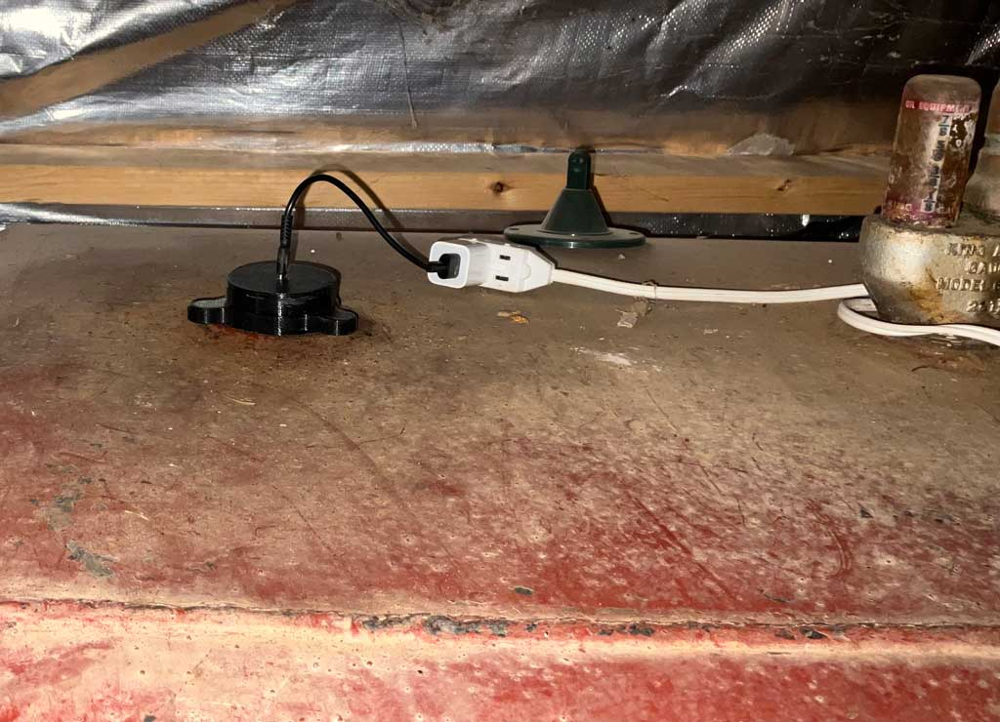

# ESPHome Oil Tank Level Monitor

This project uses ESPHome to configure an ESP32 device for monitoring the oil level in a tank. The device utilizes a VL53L0X distance sensor to measure the distance to the oil surface and calculates the remaining oil volume, daily consumption, and estimated time to depletion. Integration with Home Assistant provides real-time data visualization and tracking.

## Features

- **Real-Time Monitoring**: Tracks oil height, volume, daily consumption, and estimated days until empty.
- **VL53L0X Sensor Integration**: Measures distance to the oil surface using I2C.
- **Customizable Deviation Correction**: Adjusts measurements for environmental or sensor-specific deviations.
- **Daily Consumption Tracking**: Logs hourly changes to calculate daily oil usage.
- **WiFi Connectivity**: Includes fallback access point (AP) mode for easy troubleshooting.
- **Home Assistant API**: Secure integration with Home Assistant using encrypted communication.
- **Over-The-Air (OTA) Updates**: Enables secure firmware updates.

## Sensors

- **VL53L0X Sensor**: Measures raw distance to the oil surface.
- **Template Sensors**:
  - Oil height in inches.
  - Estimated gallons remaining.
  - Daily consumption rate in gallons/day.
  - Days until the tank is empty.

## Number Component

Allows manual adjustment of deviation correction via Home Assistant.

## Hardware Requirements

- **ESP32-C3 DevKitM-1**
- **VL53L0X Distance Sensor**
- Oil tank dimensions (customizable in the YAML file).

## Installation Instructions

1. **Hardware Setup**:
   - Connect the VL53L0X sensor to the ESP32 on the specified I2C pins (GPIO 4 for SDA and GPIO 5 for SCL).
   - Ensure the sensor is mounted securely above the oil tank.

2. **ESPHome Configuration**:
   - Clone this repository or copy the YAML file into your ESPHome project.
   - Update the WiFi credentials and secure keys as needed.

3. **Compile and Deploy**:
   - Use ESPHome to compile and upload the YAML configuration to the ESP32.
   - Add the device to Home Assistant using the API.

4. **Calibrate**:
   - Adjust the `deviation_correction` value to ensure accurate oil level measurements.

## Monitoring and Usage

- **Home Assistant Dashboard**:
  - Monitor real-time oil height, volume, and usage trends.
  - View the estimated time until empty based on daily consumption.

- **Adjustable Parameters**:
  - Modify the deviation correction or other global variables as needed via Home Assistant.

## Notes

- Ensure proper alignment of the VL53L0X sensor for accurate readings.
- Regularly check the daily consumption sensor to optimize usage and plan refills.
- Use the OTA feature to deploy updates without reconnecting the device to your computer.

## License

This project is licensed under the [MIT License](LICENSE).
